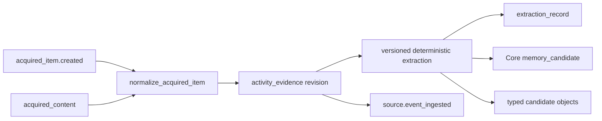

# Activity Normalizer Pack v0.1

> Provider-neutral evidence identity, immutable replay, and deterministic candidate extraction.

## Boundary

Importers parse one format and emit strict `acquired_item` records. This pack
alone owns logical evidence identity, duplicate reconciliation, revisions,
supersession, replay metadata, and versioned extraction. It stops at
candidates; promotion belongs to later policy. Settlement belongs to `usage`.
Packs compose through graph objects and `source.event_ingested` events, never
direct cross-pack calls.

Facts live here; the game lives in BabyAGI. This pack has no score, badge, or
level logic.

## Identity and revisions

The logical identity is SHA-256 over
`(source_surface_id, dedup_key)`, namespaced as `evidence_<hex>`. The importer
version is deliberately absent, so a parser upgrade cannot multiply one
provider item. A revision id hashes that identity, its monotonic revision
number, and the item content hash.

- same logical identity + same current content hash: no-op;
- same identity + changed hash: new current revision with `supersedes`;
- reversion to an older hash: another revision, preserving history;
- extractors key their run by evidence revision + extractor id/version/config.

## Replay artifact store

Persistent inputs default to a content-addressed store outside the graph log:

```text
<artifact_store>/sha256/<first-two-hex>/<full-sha256-hex>
artifact://sha256/<first-two-hex>/<full-sha256-hex>
```

The graph retains the reference and hash. `inline` retains small or ephemeral
input. `reference_only` retains bounded derived reasoning content but no exact
payload, exposes `replay_complete: false`, and replay records a loud failure
without touching `source_ref`. Re-extraction verifies the retained hash before
emitting `replay.verified`.

## Behavior map



## Objects

| Type | Purpose |
|---|---|
| `acquired_item` | Exact strict importer contract |
| `acquired_content` | Bounded reasoning handoff plus category/path/fixture metadata |
| `activity_evidence` | Immutable revision of one logical evidence identity |
| `backfill_cursor` | Provider-stable oldest/newest progress; never an offset |
| `ingestion_failure` | Explicit acquisition/normalization/replay/extraction failure |
| `extraction_record` | Candidate provenance and extractor/config lifecycle |
| `extractor_version_state` | Enabled/disabled extractor version fact |
| `preference_candidate`, `task_candidate`, `profile_candidate`, `skill_candidate`, `eval_candidate` | Typed proposals awaiting promotion |

Memory proposals use Core `memory_candidate`; `extraction_record` and
`extracted_from` provide their importer/extractor provenance without expanding
Core or writing durable memory directly.

## Tools

- `reextract_evidence` reads retained inline/artifact input only.
- `disable_extractor_version` invalidates matching extraction records and
  candidate projections while leaving evidence intact.

Only `activity.structure@0.1.0`, a deterministic zero-key extractor, ships.
The registry protocol is the seam for a future configured provider extractor;
no LLM extractor is implemented here.

## Dependencies and relations

```python
requires = ["core"]
integrates_with = []
```

| Relation | Source → target | Meaning |
|---|---|---|
| `content_for` | acquired_content → acquired_item | Pairs the parsed handoff |
| `normalizes_to` | acquired_content → activity_evidence | Records normalization |
| `acquired_from` | activity_evidence → acquired_item | Preserves acquisition provenance |
| `supersedes` | activity_evidence → activity_evidence | Links revisions |
| `extraction_for` | extraction_record → activity_evidence | Pins extractor input |
| `produced_candidate` | extraction_record → candidate | Pins extractor output |
| `extracted_from` | candidate → activity_evidence | Direct evidence provenance |

## Usage

Load `core`, this pack, and only the importers an instance needs:

```python
from activegraph import Graph, Runtime
from packs.core import pack as core_pack
from packs.activity_normalizer import pack as normalizer_pack
from packs.importers.local_files import pack as files_pack

runtime = Runtime(Graph())
runtime.load_pack(core_pack)
runtime.load_pack(normalizer_pack)
runtime.load_pack(files_pack)
```

For deterministic re-extraction, retain the evidence id and call the raw host
function with the same artifact-store configuration:

```python
from packs.activity_normalizer import ActivityNormalizerSettings
from packs.activity_normalizer.tools import reextract_evidence_fn

result = reextract_evidence_fn(
    runtime.graph,
    evidence_id,
    settings=ActivityNormalizerSettings(artifact_store_dir=".activegraph/replay-artifacts"),
)
```

## Fixtures

```bash
python packs/activity_normalizer/fixtures/run_fixtures.py
```

See [`../importers/README.md`](../importers/README.md) for adding a format adapter.
