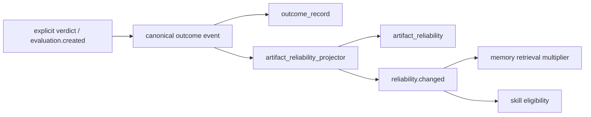

# Eval Outcome Pack v0.1

> Canonical outcomes close the usage loop; artifact reliability carries their operational effect.

## Boundary

This pack captures deterministic verdicts and projects reliability. It does not
judge with an LLM and it does not create UI. Explicit owner/user verdicts, Core
evaluations for tasks or capability results, and memory contradiction findings
are the capture seams.

Reliability is not score. Reliability belongs to the artifact, is queryable as
`artifact_reliability`, and drives eligibility or retrieval through
`reliability.changed`. Nothing here computes or reads points, badges, levels,
or any player-facing projection.

## Event vocabulary

Terminal events are mutually exclusive per `evaluation_id`:

- `outcome.helped`
- `outcome.hurt`
- `outcome.neutral`

Maintenance events are idempotent on their artifact/evidence composite keys:

- `outcome.contradicted`
- `outcome.stale`
- `outcome.superseded`

A correction creates a replacement Core evaluation and emits
`outcome.superseded`; it never attaches another terminal value to the old
evaluation. `reliability.changed` is the projection handoff consumed by Memory
Gateway and Skills. It names the outcome event that caused every eligibility or
ranking change.

## Behavior map



## Reliability

The projection records outcome tallies and the latest evidence event. The
latest canonical outcome determines the recency-aware verdict:

| Latest outcome | Verdict | Eligible | Retrieval multiplier |
|---|---|---:|---:|
| helped | supported | yes | 1.00 |
| neutral | weak | yes | 0.75 |
| hurt / contradicted | harmful | no | 0.10 |
| stale / superseded | stale | no | 0.25 |

A later helped outcome restores `supported`, making de-ranking reversible.

## Dependencies

```python
requires = ["core"]
integrates_with = ["usage", "skills", "memory_gateway", "tool_gateway"]
```

## Fixtures

```bash
python packs/eval_outcome/fixtures/run_fixtures.py
```
