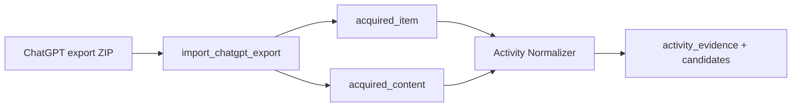

# ChatGPT Export Importer

Parses the official ChatGPT export ZIP into Activity Normalizer acquisition
records. It is a format adapter only: it does not deduplicate, create evidence,
extract candidates, settle sources, or promote state.

## Tree semantics

`conversations.json` stores each conversation as a `mapping` of nodes with
`parent` and `children` links. It is not a flat transcript.

- The root-to-`current_node` path is marked `branch_status="canonical"`.
- Every message node outside that path is retained with
  `branch_status="abandoned"` and `correction_signal=true`.
- If an older export omits `current_node`, the importer deterministically picks
  a message leaf and records `canonical_selection` in normalized metadata.
- Message identity is the provider-stable `conversation_id:node_id`. The
  Activity Normalizer owns deduplication and revision/supersession behavior.



## Emitted graph objects

This pack owns no object or relation types. For each message node it emits the
strict types owned by `activity_normalizer`:

| Type | Purpose |
|---|---|
| `acquired_item` | Stable source identity, hashes, replay policy, and importer version |
| `acquired_content` | Bounded reasoning text plus tree/branch metadata |
| `backfill_cursor` | Stable oldest/newest provider item references; never an offset |
| `ingestion_failure` | Explicit bounded parse, archive, conversation, or artifact failure |

The source category is `ai_activity` and connection path is `export`.

## Replay artifact layout

`artifact` is the default replay mode. The exact post-export-envelope message
unit is canonical JSON stored outside the graph log at:

```text
<artifact_store_dir>/sha256/<first-two-hex>/<full-sha256-hex>
```

The graph stores `artifact://sha256/<first-two-hex>/<full-sha256-hex>` and the
bare SHA-256 digest. `inline` stores that same minimal unit in the acquired
record. `reference_only` retains no payload and explicitly cannot support
verified replay.

## Usage

```python
from activegraph import Graph
from packs.importers.chatgpt_export.tools import import_chatgpt_export_fn

graph = Graph()
result = import_chatgpt_export_fn(
    graph,
    "/path/to/chatgpt-export.zip",
    "surface_chatgpt_personal",
    artifact_store_dir=".activegraph/replay-artifacts",
)
```

The registered `import_chatgpt_export` capability exposes the same options.
All parsing is keyless, deterministic, bounded, and offline.

## Bounds and failure behavior

The adapter bounds archive size, `conversations.json` size and compression
ratio, conversation count, nodes per conversation, total messages, and
normalized text length. It rejects encrypted/malformed archives, tree cycles,
missing parent nodes, ambiguous identities, and malformed conversations.
A conversation is validated before any of its messages are emitted; valid
sibling conversations remain committed.

Facts are emitted here; game concepts belong in BabyAGI.

## Fixtures

```bash
python packs/importers/chatgpt_export/fixtures/run_fixtures.py
```
