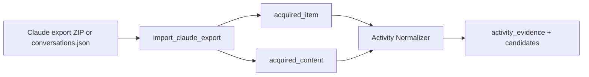

# Claude Export Importer

Parses the official Claude data export into Activity Normalizer acquisition
records. It is a format adapter only: it does not deduplicate, create evidence,
extract candidates, settle sources, or promote state.

## Flat-list semantics

Claude's `conversations.json` is a flat list of conversations, each with an
ordered `chat_messages` transcript — there is no branch tree like the ChatGPT
export.

- Every message becomes exactly one `acquired_item` + `acquired_content` pair.
- Message identity is the provider-stable `conversation_uuid:message_uuid`.
  The Activity Normalizer owns deduplication and revision/supersession
  behavior; re-import intentionally re-emits.
- Message text prefers the typed `content` block list; a block of an unknown
  type is retained as `[<type> content omitted]`. Older messages without a
  block list fall back to the plain `text` field
  (`content_source="text_field"` in normalized metadata).
- The importer accepts both the export ZIP archive and a bare
  `conversations.json` file (users often unzip first), detected by extension
  and magic bytes.



## Emitted graph objects

This pack owns no object or relation types. For each chat message it emits the
strict types owned by `activity_normalizer`:

| Type | Purpose |
|---|---|
| `acquired_item` | Stable source identity, hashes, replay policy, and importer version |
| `acquired_content` | Bounded reasoning text plus conversation/sender metadata |
| `backfill_cursor` | Stable oldest/newest provider item references; never an offset |
| `ingestion_failure` | Explicit bounded parse, archive, conversation, or artifact failure |

The source category is `ai_activity` and connection path is `export`.

## Replay artifact layout

`artifact` is the default replay mode. The exact post-export-envelope message
unit is canonical JSON stored outside the graph log at:

```text
<artifact_store_dir>/sha256/<first-two-hex>/<full-sha256-hex>
```

The graph stores `artifact://sha256/<first-two-hex>/<full-sha256-hex>` and the
bare SHA-256 digest. `inline` stores that same minimal unit in the acquired
record. `reference_only` retains no payload and explicitly cannot support
verified replay.

## Usage

```python
from activegraph import Graph
from packs.importers.claude_export.tools import import_claude_export_fn

graph = Graph()
result = import_claude_export_fn(
    graph,
    "/path/to/claude-export.zip",  # or /path/to/conversations.json
    "surface_claude_personal",
    artifact_store_dir=".activegraph/replay-artifacts",
)
```

The registered `import_claude_export` capability exposes the same options.
All parsing is keyless, deterministic, bounded, and offline. Timestamps are
provider timestamps only; the importer never reads the wall clock.

## Bounds and failure behavior

The adapter bounds archive size, `conversations.json` size and (ZIP-only)
compression ratio, conversation count, messages per conversation, total
messages, and normalized text length. It rejects encrypted/malformed archives,
missing or duplicate identities, and malformed conversations. A conversation
is validated before any of its messages are emitted; valid sibling
conversations remain committed.

Facts are emitted here; game concepts belong in BabyAGI.

## Fixtures

```bash
python packs/importers/claude_export/fixtures/run_fixtures.py
```
