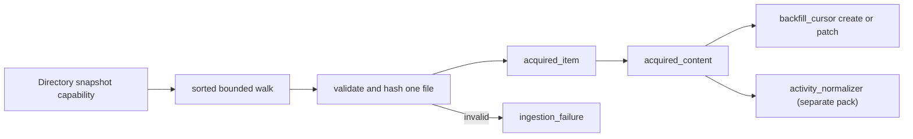

# Local Files Importer

`local_files` turns a bounded directory snapshot into Activity Normalizer's
provider-neutral acquired-item stream. It supports UTF-8 text, Markdown, and
JSON with no API key or network access.

## Behavior map



This importer has no reactive behaviors. Its capability records graph events;
the normalizer reacts to `acquired_content` after the import call returns.

## Surface

### Object types

None. The pack emits types owned and validated by `activity_normalizer`:
`acquired_item`, `acquired_content`, `backfill_cursor`, and
`ingestion_failure`.

### Relation types

None. The acquired-content record carries `acquired_item_id`; downstream
evidence relations are normalizer-owned.

### Capability

```python
import_local_files_fn(
    graph,
    root_path,
    source_surface_id,
    *,
    artifact_store_dir=".activegraph/replay-artifacts",
    replay_mode="artifact",
    is_fixture=False,
    max_files=1000,
    max_file_bytes=2_000_000,
    max_normalized_chars=8192,
    extensions=None,
)
```

The result reports `ok`, `imported`, `failed`, `cursor_id`,
`acquired_item_ids`, `failure_ids`, and `stopped_at_bound`.

## Identity and progress

Files are walked in sorted relative-POSIX-path order without following file or
directory symlinks. Both `provider_item_id` and `dedup_key` are the relative
path within the selected root, so moving the containing root does not change
item identity. `source_ref` keeps the resolved access path.

The importer does not deduplicate. A second snapshot emits the same stable
identity and hashes; Activity Normalizer turns that into a no-op. Changing a
file keeps the identity but changes its hashes, allowing the normalizer to
create a superseding evidence revision.

After each complete acquired-item/content pair, the surface's
`backfill_cursor` is created or patched with stable relative-path refs. A
stopped process therefore leaves a smaller committed snapshot, not a corrupt
batch. Page numbers and offsets are never stored.

## Replay-store layout

Artifact mode writes exact UTF-8 normalizer input at:

```text
<artifact_store>/sha256/<first-two-hex>/<full-sha256-hex>
```

and records
`artifact://sha256/<first-two-hex>/<full-sha256-hex>`. The graph keeps only
bounded normalized reasoning content (8,192 characters by default), not a
second wholesale copy of every file.

## Usage

```python
from activegraph import Graph, Runtime
from packs.activity_normalizer import pack as normalizer_pack
from packs.importers.local_files import pack as importer_pack
from packs.importers.local_files.tools import import_local_files_fn

graph = Graph()
runtime = Runtime(graph)
runtime.load_pack(normalizer_pack)
runtime.load_pack(importer_pack)

result = import_local_files_fn(
    graph,
    "/path/to/knowledge",
    "surface_local_knowledge",
    artifact_store_dir="/path/to/replay-store",
)
runtime.run_until_idle()
```

For a deliberately replay-incomplete privacy policy:

```python
result = import_local_files_fn(
    graph,
    "/path/to/licensed-notes",
    "surface_private_notes",
    replay_mode="reference_only",
)
```

The initial bounded derived content can still produce evidence and candidates,
but downstream replay reports incomplete and fails instead of rereading these
files.

## Failure posture

- Missing or symlink roots record `invalid_root`.
- Oversized, unreadable, or invalid UTF-8 files record `invalid_file`.
- Malformed JSON records `invalid_json` and creates no acquired pair for that
  file.
- Snapshot breadth, per-file bytes, and graph-resident normalized characters
  are bounded.
- Valid sibling files commit independently; a bad file never rolls back good
  progress.

No settling logic, candidate extraction, score, badges, or levels live here.
The importer supplies facts; Activity Normalizer and Usage own their respective
projections, and the game belongs in BabyAGI.
