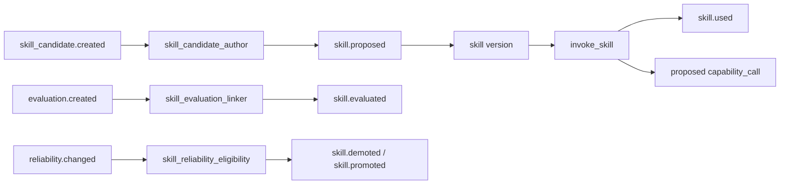

# Skills Pack v0.1

> Governed learned artifacts: immutable versions, provenance, usage, evaluation, and reversible eligibility.

## Boundary

A skill is what the agent has learned. A capability is what the agent can call.
Skill invocation records an exact version and may propose `capability_call`
objects, but it never executes an external effect directly.

Reliability is not score. `eval_outcome` owns the separately queryable
reliability projection; this pack consumes `reliability.changed` only to adjust
eligibility. It computes no points, badges, levels, or player-facing numbers.

## Behavior map



## Object types

| Type | Purpose |
|---|---|
| `skill` | One immutable semantic version plus reversible lifecycle state |
| `skill_usage` | One idempotent invocation of an exact version |
| `skill_promotion_evidence` | Trial, replay, verification, accepted-use, task, or owner proof |
| `skill_evaluation_link` | Connects one usage to its Core `evaluation` |

Definition identity covers name, semantic version, description, triggers,
required capabilities, and contraindications. Once a version exists, changing
any of those fields requires a new semantic version. First use additionally
locks the definition in graph state.

## Lifecycle

`candidate → promoted → demoted → promoted` is reversible. `disabled` remains
historical and can be restored only through explicit owner-approved evidence.
Demotion and disable remove eligibility without deleting the version, its
provenance, usages, evaluations, or outcomes.

Promotion requires a `skill_promotion_evidence` object accepted for the exact
version and a supporting reliability basis. When the generic reliability
projection exists, its verdict is authoritative. Before an outcome exists,
accepted trial, replay, verification, task, repeated-use, or owner evidence is
the recorded support basis.

## Invocation

- Trial execution may invoke a candidate when enabled.
- Real execution requires `promoted` status.
- `demoted` and `disabled` versions are ineligible.
- Retrying the same `usage_id` returns the original `skill_usage`; a different
  version or execution reference under that id is rejected.
- Capability requests must be declared by the version and become proposed Tool
  Gateway calls. The skills pack never calls a provider directly.

## Dependencies

```python
requires = ["core"]
integrates_with = ["activity_normalizer", "tool_gateway", "eval_outcome"]
```

## Fixtures

```bash
python packs/skills/fixtures/run_fixtures.py
```
