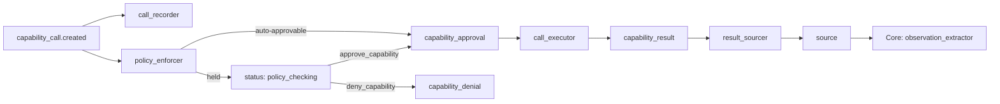

# Tool Gateway Pack v0.3

> The capability execution gateway. All external calls flow through here.

## Overview

Tool Gateway Pack ensures every external capability call (API, local function, MCP server, SDK) is:
- **Policy-checked** before execution (risk class vs. auto-approve list)
- **Graph-visible** (CapabilityCall, CapabilityApproval, CapabilityDenial, CapabilityResult are all graph objects)
- **Auditable** (full call record with inputs, outputs, decisions, timestamps)
- **Credential-hygienic** (secrets injected at execution time via the Secrets Pack; never stored)
- **Bridged to Core** (results become Core `source` objects for observation extraction)

Secrets never enter model context — `credential_ref_name` is a name reference only.

**The graph is the single source of truth for approval state.** A pending
approval *is* a `capability_call` at `status='policy_checking'`; a decision
*is* a `capability_approval` or `capability_denial` object. There is no
side-channel queue to poll or lose on restart.

## Behavior Map

```
capability_call.created (status=proposed)
  → call_recorder
      creates calls(capability_call → capability_provider) relation

  → policy_enforcer
      risk_class auto-approvable:
        patches status → "approved", creates capability_approval
      otherwise:
        patches status → "policy_checking"  [held — see Approval resolution]

capability_approval.created                  ← the ONLY execution trigger
  → call_executor
      patches status → "executing"
      resolves + injects credential via Secrets Pack (value never stored)
      executes via the local capability registry
      sanitizes output, creates capability_result
      patches status → "done" | "failed"
      creates produces_result relation

capability_result.created
  → result_sourcer
      creates source (kind=tool_result)
      creates sourced_as(capability_result → source) relation
      [Core Pack observation_extractor then fires on source.created]
```



## Approval resolution (held calls)

A call whose `risk_class` is not auto-approvable is held at
`status='policy_checking'`. Two tools resolve it — and they are the *only*
way it advances:

- `approve_capability(graph, call_id, approver_ref, note)` — creates the
  same `capability_approval` object `policy_enforcer` creates for
  auto-approved calls. `call_executor` fires on it: **one execution
  trigger, no second path.**
- `deny_capability(graph, call_id, approver_ref, reason)` — patches the
  call to `rejected` and records a `capability_denial` (who, why, when),
  linked via `denied_by`. Refusals are audit objects, not status flips.

`pending_approvals(graph)` lists held calls, oldest first. (The demo server
exposes these as `GET/POST /approvals`.)

**Approver verification.** When the Identity/Auth Pack is loaded and
principals are registered, the `approver_ref` must resolve to a principal
whose role is in `ToolGatewaySettings.approver_roles` (default
`["owner", "admin"]`); unknown refs are refused. Without Identity/Auth the
gateway degrades gracefully and records the decision with
`verification='identity_unverified'` — verification happens when
verification is possible.

## Object Types

| Type | Description | Key Fields |
|------|-------------|------------|
| `capability_provider` | Registered external capability provider | `name`, `kind` (local/api/mcp/sdk/webhook), `base_url`, `capabilities`, `credential_ref_name` |
| `capability_call` | A proposed or executing capability call | `provider_id`, `capability_name`, `input_data`, `credential_ref_name`, `risk_class`, `status` |
| `capability_approval` | Graph-visible execution trigger — every executed call has one | `call_id`, `policy_decision` (auto_approved/manual), `approver`, `approved_at` |
| `capability_denial` | Audited refusal of a held call | `call_id`, `denier`, `reason`, `denied_at` |
| `capability_result` | The result of an executed call | `call_id`, `output_data`, `error`, `success`, `executed_at`, `source_id` |

### CapabilityCall Status Lifecycle
```
proposed → approved (auto)            → executing → done | failed
proposed → policy_checking → approved (manual) → executing → done | failed
proposed → policy_checking → rejected (denied)
```

### Risk Classes
- `low` — read-only, safe, no side effects
- `medium` — writes to external systems
- `high` — financial or legal consequences
- `critical` — irreversible (delete, send payment)

## Relation Types

| Relation | Source → Target | Description |
|----------|-----------------|-------------|
| `calls` | capability_call → capability_provider | Which provider the call targets |
| `approved_by` | capability_call → capability_approval | The decision that let the call execute |
| `denied_by` | capability_call → capability_denial | The decision that refused the call |
| `produces_result` | capability_call → capability_result | Execution result |
| `sourced_as` | capability_result → source | Bridge to Core Pack for observation extraction |

## Dependencies

```python
requires = ["core"]
integrates_with = ["secrets", "identity_auth"]
# secrets       — credential reference resolution at execution time
# identity_auth — approver verification for manual approve/deny
```

## Usage

### The graph-driven flow (auto-approved)

```python
from activegraph import Runtime, Graph
from packs.core import pack as core_pack
from packs.tool_gateway import pack as tg_pack, ToolGatewaySettings
from packs.tool_gateway.tools import register_local_capability

# Register a local capability
def lookup_company(company_name: str) -> dict:
    return {"name": company_name, "founded": 2021, "arr": "$2M"}

register_local_capability("crm", "lookup_company", lookup_company)

rt = Runtime(Graph())
rt.load_pack(core_pack)
rt.load_pack(tg_pack, settings=ToolGatewaySettings(
    auto_approve_risk_classes=["low", "medium"],
))

# Propose the call — that is ALL the caller does. policy_enforcer approves,
# call_executor executes, result_sourcer bridges the output to Core.
call = rt.graph.add_object("capability_call", {
    "provider_id": "prov#1",
    "provider_name": "crm",
    "capability_name": "lookup_company",
    "input_data": {"company_name": "Northwind Robotics"},
    "risk_class": "low",
    "status": "proposed",
})
rt.run_until_idle()

print(rt.graph.get_object(call.id).data["status"])  # "done"
```

### The held flow (manual approval)

```python
from packs.tool_gateway.tools import (
    pending_approvals_fn, approve_capability_fn, deny_capability_fn,
)

call = rt.graph.add_object("capability_call", {
    "provider_id": "prov#1",
    "provider_name": "crm",
    "capability_name": "initiate_payment",
    "input_data": {"amount_usd": 50000},
    "risk_class": "high",           # not auto-approvable
    "status": "proposed",
})
rt.run_until_idle()                  # held at status='policy_checking'

for held in pending_approvals_fn(rt.graph):
    print(held["capability_name"], held["risk_class"])

approve_capability_fn(rt.graph, call.id, approver_ref="user:owner",
                      note="Verified out-of-band.")
rt.run_until_idle()                  # call_executor runs it now

# ... or refuse it, with the refusal recorded as a graph object:
# deny_capability_fn(rt.graph, call.id, approver_ref="user:owner",
#                    reason="Payment not recognized.")
```

## LLM tool proxies (agentic chat)

The runtime's native tool loop (`@llm_behavior(tools=[...])`) executes Tool
functions directly — no policy check, no credential injection, no record.
So the tools handed to a model are never raw capabilities; they are
**proxies into this gateway** (`llm_tools.py`):

```python
from packs.tool_gateway.tools import register_local_capability
from packs.tool_gateway.llm_tools import llm_tools_for

register_local_capability(
    "crm", "lookup_company", my_lookup,
    input_schema=LookupInput,          # what the model sees as parameters
    description="Look up a company.",  # what the model reads
    risk_class="low",                  # what policy decides with
)

tools = llm_tools_for(graph, ["crm.lookup_company"])   # → [Tool]
# hand these to @llm_behavior(tools=[...]) — e.g. via the Chat Pack's
# ChatSettings.tool_allow_list (see packs/chat and bundles/assistant.py)
```

When the model calls a proxy:
1. a `capability_call` is recorded **before anything runs** (audit before action);
2. `decide_policy` — the same single implementation `policy_enforcer` uses —
   classifies it;
3. auto-approvable → executed inline via `execute_approved_call` (credential
   injection, sanitization, `capability_result`, `produces_result`), the
   sanitized result returns to the model in the same tool turn, and the
   `capability_approval` is recorded;
4. held → the call stays at `policy_checking` and the model is told
   `held_for_approval`; the normal approve/deny path resolves it later.

Double execution is impossible by construction: the inline path records its
approval after the call is already `done`, and `call_executor` guards on
`status == 'approved'`. One approval → at most one execution, on both paths.

`capabilities.py` ships `register_web_fetch_capability()` — the runtime's
stdlib `web_fetch` reference tool as the gateway capability `web.fetch_url`
(read-only, low risk): the canonical first agentic tool.

## Settings

| Field | Default | Description |
|-------|---------|-------------|
| `auto_approve_risk_classes` | `["low"]` | Risk classes auto-approved without human review |
| `approver_roles` | `["owner", "admin"]` | Roles allowed to approve/deny held calls (enforced when Identity/Auth is active) |
| `record_input_data` | `True` | Record input params in CapabilityCall |
| `record_output_data` | `True` | Record output in CapabilityResult |
| `max_output_chars` | `10000` | Max chars stored in output_data |
| `create_source_from_result` | `True` | Create Core source from each result |
| `sanitize_output` | `True` | Redact key/token/password patterns from output before storing |
| `inject_credentials` | `True` | Resolve + inject credential_ref via Secrets Pack at execution time |

## Fixtures

```bash
python packs/tool_gateway/fixtures/run_fixtures.py
```

- `tool_call_flow` — low-risk call: propose → auto-approve → execute → source
- `manual_approval_flow` — high-risk call: propose → held → approve → execute → source
- `manual_denial_flow` — high-risk call: propose → held → deny → rejected, no execution

## CHANGELOG

See [`CHANGELOG.md`](CHANGELOG.md).
