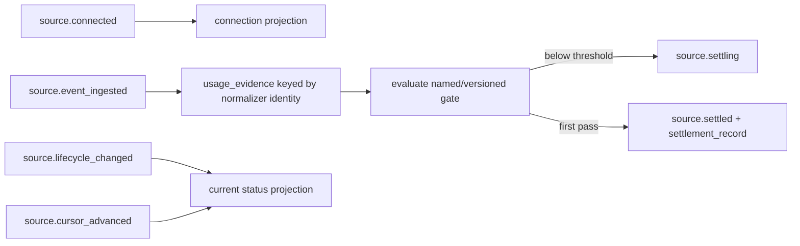

# Usage Pack v0.1

> Deterministic facts about connected sources, settlement, coverage, interactions, and observed outcomes.

## Boundary

`usage` is the stack's neutral observational surface. It consumes
normalizer-owned `source.event_ingested` identities and never parses provider
formats or deduplicates content independently. Importers own parsing; Activity
Normalizer owns logical evidence identity; this pack owns connection and
settlement projections.

Facts live here; the game lives in BabyAGI. This pack awards no points and has
no badge or level concepts in its runtime surface.

## Canonical categories

The v0 set is closed:

```text
communication · rhythm · ai_activity · code_work · local_knowledge
tool_automation · outcome_evaluation
```

Provider and connection path are metadata. Unknown categories raise at the
API boundary and fail closed if encountered in an event projection; they
never become an `other` bucket.

## Settlement semantics

The immutable default gate is `usage.category.default@1`:

```yaml
min_unique_events: 25
min_coverage_days: 3
allow_either: true
```

Settlement is evaluated per surface. A category is currently settled when at
least one of its surfaces is currently settled; evidence is never pooled
across separate surfaces to pass a gate. `source.connected` alone cannot pass.
The first pass emits one historical `source.settled` contribution for
`(surface_id, gate_id, gate_version)` and records which threshold passed.
Reconnects and retries reuse that contribution.

For snapshots/backfills, coverage is the UTC calendar-date delta from the
earliest to latest provider timestamp among current, qualifying logical
evidence identities. For example, January 1 to January 4 is three coverage
days. A superseding revision replaces the prior revision's provider time but
does not increment the unique count. Live surfaces may extend the span with
explicit `source.clock` facts, but only after at least one qualifying evidence
identity exists. Ambient wall-clock time is never read.

There is no invented freshness TTL. `stale`, `revoked`, and `failed` come from
explicit logged lifecycle facts. A new gate definition requires a new version.

## Qualifying evidence

An identity qualifies only when it has all of: normalizer-owned stable
identity, canonical category, surface/source provenance, connection-path
metadata, importer id/version, `is_fixture: false`, and no invalidation.
Fixture evidence remains visible but is excluded from counts and settlement.
`reference_only` evidence may qualify; replay completeness is a separate fact.

## Explicit-horizon query API

Every query requires `event_horizon_event_id`. The projector reads canonical
log order only through that event, so identical log + horizon always produces
the same result.

- `project_usage_fn` — complete neutral projection;
- `list_connection_surfaces_fn` — surface metadata and current status;
- `get_settlement_state_fn` — gate/version and passing thresholds;
- `get_coverage_statistics_fn` — per-surface and per-category unique counts and spans;
- `get_usage_statistics_fn` — idempotent interaction observations;
- `get_outcome_statistics_fn` — tallies existing `outcome.*` events without capturing them.

```python
from packs.usage.tools import connect_surface_fn, project_usage_fn

connect_surface_fn(
    runtime.graph,
    "surface_local_knowledge",
    category="local_knowledge",
    provider={"name": "filesystem"},
    path="local",
    privacy_scope="folder",
)
runtime.run_until_idle()

horizon = runtime.graph.events[-1].id
projection = project_usage_fn(runtime.graph, horizon)
```

Historical inspection is the same call with an earlier event id:

```python
before_revocation = project_usage_fn(runtime.graph, settled_horizon)
after_revocation = project_usage_fn(runtime.graph, revoked_horizon)
```

## Behavior map



## Objects and relations

| Type | Purpose |
|---|---|
| `connection_surface` | Current provider-neutral source state |
| `settling_gate` | Immutable gate definition |
| `usage_evidence` | Current revision indexed by normalizer evidence identity |
| `settlement_record` | Historical first pass of one gate version |
| `usage_record` | Idempotent interaction observation |
| `usage_projection_failure` | Fail-closed projection error |

| Relation | Source → target |
|---|---|
| `evidence_on_surface` | usage_evidence → connection_surface |
| `settlement_for` | settlement_record → connection_surface |
| `usage_on_surface` | usage_record → connection_surface |

## Dependencies

```python
requires = ["activity_normalizer"]
integrates_with = []
```

## Fixtures

```bash
python packs/usage/fixtures/run_fixtures.py
```

The source-zero scenario imports the live `/tmp/vision` clone when available.
Offline CI expands a checked-in bounded snapshot derived from the same
constitution, then also imports a branching ChatGPT export to prove two
settled categories through different gate thresholds.
